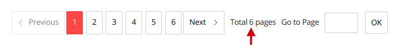

## Parser BeautifuSoup + Telegram Bot


This is an automated software solution that collects and processes information according to certain criteria, and sends the result to Telegram.
This Parser makes a selection of smart watches Xiaomi that are on sale at a discount on the AliExpress marketplace. This Parser was created purely for cognitive purposes, under certain conditions its capabilities are greatly expanded.


<p align="center"></p>


## Technology in the project

I had some problems creating a loop that would end on the last page, taking into account that we don't know the number of the last page because the number of pages with product data on them can change constantly.
That is why I initially chose an unrealistically high number of pages in the loop as a constant:


```shell
for p in range(1, 1000):
```

However, getting the exact number of pages at a given time is not such a daunting task. I decided to take this data directly from the product page.


<p align="center"></p>


In this way I got such a solution:


```python
n = int(re.findall(r'\d+', (soup.find(
            'div',
            class_='SearchPagination_SearchPagination__pagination__wjhu3'
            ).find(
            'span', class_='SearchPagination_SearchPagination__label__wjhu3'
            ).text.split()[1]))[0])

        if p == n:
            break
```

The main magic happened in this code:


```python
for watch in watchs:
            discount = watch.find(
                'div', class_='snow-price_SnowPrice__discountPercent__2y0jkd'
                ).text
            link = "https://aliexpress.ru" + watch.find(
                'a',
                class_='product-snippet_ProductSnippet__galleryBlock__tusfnx'
                ).get('href')
            name = watch.find(
                'div', class_='product-snippet_ProductSnippet__name__tusfnx'
                ).text
            photo = "https:" + watch.find(
                'img', class_='gallery_Gallery__image__1ln22f').get('src')

            data.append([discount, link, name, photo])
```
The results of the selection are saved in a json file:

```python
with open("data.json", "w") as file:
        json.dump(data, file, indent=4, ensure_ascii=False)
```


The ready posts we get in the messenger Telegram were created in this code:


```python
for item in data:
        photo = "".join(item[3])
        name = "".join(item[2])
        discount = "".join(item[0])
        link = "".join(item[1])

        await bot.send_photo(message.chat.id, photo, caption="<b>" + name
                             + "</b>\n<b>" + f"Скидка: {discount}"
                             + f"</b>\n<a href='{link}'>Ссылка на сайт</a>",
                             parse_mode="html")
```
